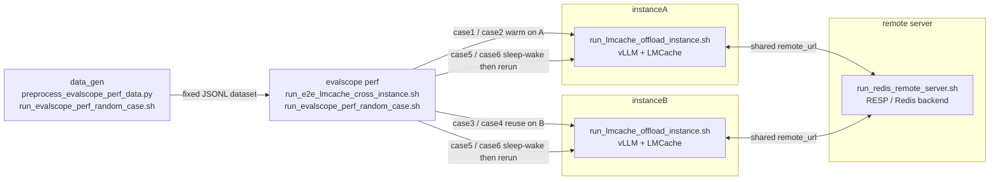
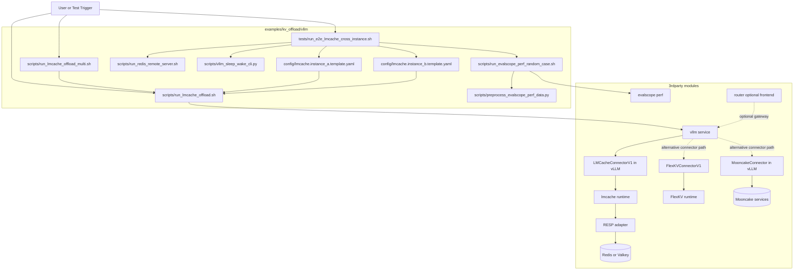

# vLLM KV Offload

This directory contains the vLLM KV offload scripts, tests, and special-case launchers.

## Cross-instance test topology

The diagram below shows the call relationship for the cross-instance benchmark flow:

- `data_gen` builds or reuses the fixed EvalScope dataset
- `evalscope perf` drives the benchmark cases
- `instanceA` and `instanceB` are the two vLLM + LMCache servers
- `remote server` is the shared Redis/RESP backend used for cross-instance reuse

## Cross-project module call graph

The graph below summarizes how local scripts in this directory orchestrate
the third-party modules under `3rdparty/` during KV offload experiments.

- Solid arrows: default execution path in LMCache cross-instance tests.
- Dashed arrows: optional or alternative connector paths.

## Related scripts

- [scripts README](scripts/README.md)
- [cross-instance special case](tests/cross_instance_manual/README.md)
