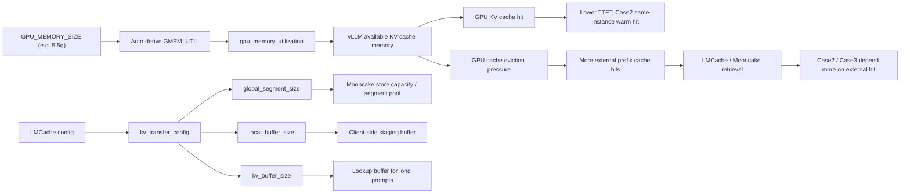

# GPU Memory and KV Cache Flow

说明：
- `GPU_MEMORY_SIZE` 只是一个更直观的目标值，脚本里会换算成 `gpu_memory_utilization`。
- `gpu_memory_utilization` 决定 vLLM 能拿多少显存做 KV cache。
- `kv_buffer_size`、`global_segment_size`、`local_buffer_size` 是 LMCache / Mooncake 侧的不同容量参数。
- 如果你把 `gpu_memory_utilization` 调低，GPU KV cache 更容易被挤掉，case2 / case3 就更可能依赖 external hit。
